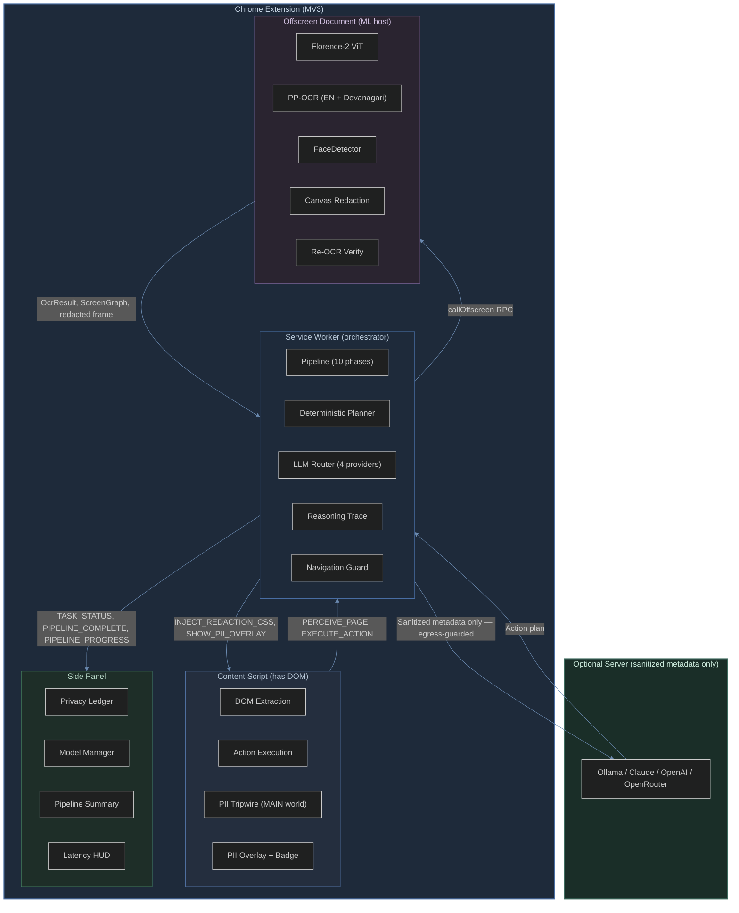
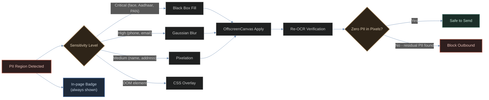
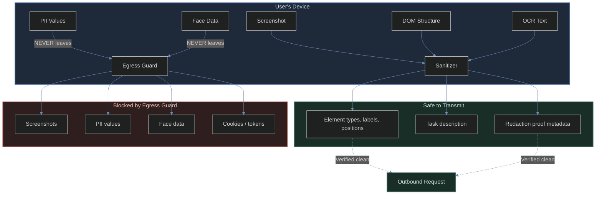

# VLESS

**Privacy-preserving browser automation through on-device visual perception.**

VLESS is a Chrome extension that uses local machine learning models to understand web pages, detect and redact personally identifiable information (PII), and automate browser tasks -- all without sending sensitive data to any external server.

Built for [Smart India Hackathon 2026](https://sih.gov.in/sih2026PS) Problem Statement 26171: *On-device Visual Perception for Lightweight Browser Agents*.

---

## Table of Contents

- [Overview](#overview)
- [Architecture](#architecture)
- [How It Works](#how-it-works)
- [Privacy Model](#privacy-model)
- [Evaluation Criteria](#evaluation-criteria)
- [Tech Stack](#tech-stack)
- [Project Structure](#project-structure)
- [Getting Started](#getting-started)
- [Testing](#testing)
- [Competitive Analysis](#competitive-analysis)
- [License](#license)

---

## Overview

Modern browser agents like Browser Use, Anthropic Computer Use, and OpenAI Operator all share a critical limitation: they send full screenshots to cloud servers for processing. These screenshots contain passwords, financial data, personal messages, and identity documents.

VLESS eliminates this privacy risk by running visual perception models directly in the browser. Only sanitized, structural metadata leaves the device. Raw screenshots, form values, and PII never leave the client.

### Key Capabilities

- **Tri-signal Perception** -- DOM extraction for standard pages (10ms), PP-OCR for visible text (200ms), Florence-2 ViT for visual grounding (1-3s). All three signals are fused into a unified ScreenGraph with IoU-based deduplication.
- **Checksum-gated PII Detection** -- Aadhaar validated via Verhoeff algorithm, PAN through format and series checks, credit cards via Luhn algorithm, IFSC through structural validation. Eliminates false positives that plague regex-only approaches.
- **Provable Privacy** -- An egress guard scans every request VLESS itself sends to an LLM and refuses to transmit one carrying checksum-validated PII. A MAIN-world tripwire separately reports what the page's own traffic carries. Re-OCR verification proves PII is gone from redacted pixels before anything leaves the device. All of this is DevTools-verifiable.
- **Deterministic Planning** -- For form-filling tasks, a local planner maps field labels to user data without any LLM, achieving sub-100ms planning. LLM planning is available as a fallback for complex tasks.
- **Navigation-safe Execution** -- The pipeline detects when an action navigates to a new URL. It waits for the new page to fully load (`tabs.onUpdated` complete) before any further content script messaging, preventing the "Receiving end does not exist" crash that plagues other MV3 agents.
- **Full Explainability** -- An Agent Reasoning Trace logs every decision with what the agent observed, what it considered, what it decided, and whether verification passed.

---

## Architecture



---

## How It Works

### Pipeline Phases

The pipeline runs in 10 phases, each with a clear boundary and latency budget:

| Phase | Description | Latency | Execution Context |
|-------|-------------|---------|-------------------|
| 1. Capture | DOM extraction + `captureVisibleTab` screenshot | ~50ms | Content Script |
| 1.5 Vision Perception | Florence-2 ViT: open-vocab detection, OCR-with-region, caption | ~1-3s | Offscreen |
| 2. Detect PII | DOM regex + PP-OCR text scan + FaceDetector + checksum gates | ~200-500ms | Service Worker |
| 3. Redact | CSS injection + offscreen canvas (blur/black-box/pixelate) + PII badge overlay | ~100ms | Content + Offscreen |
| 3.5 Verify Redaction | Re-OCR the redacted frame, assert zero residual PII | ~200ms | Offscreen |
| 4. Initialize Server | Find best LLM backend (Ollama → Claude → OpenAI → rule-based) | ~100ms | Service Worker |
| 5. Extract (if read task) | On-device extraction short-circuit — no LLM, no egress | ~1ms | Service Worker |
| 6. Build Sanitized Context | Strip PII values, keep structural metadata only | ~1ms | Service Worker |
| 7. Get Plan | Deterministic planner or LLM generates action steps | ~100ms-10s | Service Worker |
| 8. Execute | Content script clicks/types/scrolls with native-setter; nav-guard waits for page load | ~300ms/step | Content Script |
| 8.5 Review | Re-perceive page after execution (skipped after navigation) | ~50ms | Content Script |
| 9. Show Status | Pipeline summary panel + reasoning trace + privacy proof | ~10ms | Side Panel |

### Tri-Signal Perception

The core innovation is a perception pipeline that combines three independent signals:

1. **DOM Extraction** (structural backbone, ~10ms) -- Extracts all interactive elements: form fields, buttons, links, dropdowns. Provides labels, ARIA attributes, positions, and semantic roles. Fast and accurate for standard HTML pages.

2. **PP-OCR** (visible text, ~200ms) -- Runs PaddleOCR detection + recognition models in the offscreen document via ONNX Runtime Web. Reads text that DOM cannot access: canvas-rendered content, images, PDFs, and dynamically generated text. Supports English and Devanagari.

3. **Florence-2 ViT** (visual grounding, ~1-3s) -- Microsoft's Florence-2-base-ft runs via @huggingface/transformers in the offscreen document. Performs open-vocab object detection (`<OD>`), OCR with bounding boxes (`<OCR_WITH_REGION>`), and page captioning (`<CAPTION>`). Catches UI elements and text that both DOM and PP-OCR miss.

These three signals are fused into a **ScreenGraph** -- a unified representation of everything visible on screen. IoU-based deduplication prevents double-counting across signals. The result feeds into PII detection and action planning.

### PII Detection (Checksum-Gated)

The detection engine uses checksum validation to eliminate false positives:

| PII Type | Validation Method | Precision |
|----------|-------------------|-----------|
| Aadhaar | Verhoeff checksum (12-digit mathematical validation) | ~99.9% |
| PAN Card | Format + series validation (ABCDE1234F, valid first-char series) | ~99.5% |
| Credit/Debit | Luhn algorithm (13-19 digit validation) | ~99.9% |
| IFSC Code | Structural validation (4 letters + 0 + 6 alphanumeric) | ~99% |
| Phone (Indian) | Prefix validation (6-9) + 10-digit format | ~95% |
| Email | Standard regex pattern matching | ~98% |
| Face | Chrome FaceDetector API (ML-based, 95%+ accuracy) | ~95% |
| Password | DOM input[type=password] + visual dot detection | ~99% |

Without checksum validation, a 10-digit number like a year, quantity, or order ID would be flagged as a phone number. With checksum validation, only genuine phone numbers (starting with 6-9) are detected.

### Redaction and Verification



Four redaction strategies are applied based on sensitivity:

- **Black Box** (critical) -- Solid black rectangle over passwords, Aadhaar numbers, PAN numbers, credit card numbers. Completely obscures the content.
- **Gaussian Blur** (high) -- Multi-pass box blur approximation on faces and profile photos. Content becomes unrecognizable while preserving spatial layout.
- **Pixelation** (medium) -- Block averaging creates a mosaic effect on names, addresses, and moderate-sensitivity text. Readable as "something is there" but not what it says.
- **CSS Overlay** (DOM elements) -- Injects CSS rules that highlight sensitive form fields with colored borders and labels, visible to the user but not in the screenshot.

The **In-page PII Badge** always appears at the top-center of the page when PII is detected -- even for text-only PII (like an Aadhaar number found in page text) that has no visual bounding box. It shows a color-coded breakdown by category (Aadhaar, Phone, PAN, etc.) with a count, and auto-dismisses after 8 seconds.

After redaction, the **Re-OCR Verification** step re-runs OCR on the redacted frame. If any PII text is still readable in the pixels, verification fails and the pipeline reports the issue. This is the mechanism that proves redaction worked -- not a claim, but a measured assertion.

---

## Privacy Model

### Data Flow Control



### What Never Leaves the Device

- Raw screenshots (may contain passwords, personal data, financial info)
- Form field values (Aadhaar numbers, PAN, phone, email, bank details)
- Face data (detected via FaceDetector API)
- Browsing history
- Cookies and session tokens
- Any text detected as PII by the checksum-gated detector

### What CAN Be Transmitted

- DOM element structure (types, labels, ARIA roles, positions)
- Task description ("fill this form with my data")
- Redaction proof metadata (what was detected, how it was redacted)
- Sanitized ScreenGraph (no PII values, only structural information)

### Provable Privacy (Five Mechanisms)

1. **Egress Guard** -- Every outbound call VLESS makes to an LLM provider goes through `guardedFetch`, which serializes the request body and scans it with the checksum-gated detectors (Verhoeff for Aadhaar, Luhn for cards, format+series for PAN and IFSC, subscriber-range for phone). A match aborts the request before it reaches the network, so no DevTools entry is produced at all. Blocking is confined to traffic VLESS originates — that is traffic it is responsible for, and a false positive there degrades planning rather than breaking a website.

2. **PII Tripwire (page monitor)** -- A separate MAIN-world content script patches the page's own `fetch`/`XMLHttpRequest` to report which site requests carried PII. It must run in the MAIN world: a content script's isolated world has its own `fetch`, so patching it there observes nothing the page does. It is deliberately **observe-only** — sites legitimately POST the user's own phone number and email to their own servers, and blocking that would break every login and checkout on the web. Observations feed the Privacy Ledger; values are masked before they are recorded.

3. **Re-OCR Verification** -- After redacting the screenshot in the offscreen document, the redacted image is re-OCRed. The OCR output is scanned for residual PII patterns. If any remain, verification fails. This proves that the redaction actually removed PII from the pixels.

4. **Privacy Proof Ledger** -- A live dashboard in the side panel displays: outbound requests monitored, PII-containing requests blocked, bytes inspected vs. blocked, re-OCR verification status, and an overall privacy score. Updates in real-time during pipeline execution.

5. **DevTools Verification** -- Open Chrome DevTools, navigate to the Network tab, run the agent, and verify that zero PII appears in any outbound request. The only data that leaves the device is sanitized structural metadata.

---

## Evaluation Criteria

| Criterion | Weight | VLESS Implementation | How It Wins |
|-----------|--------|---------------------|-------------|
| Visual context accuracy | 25% | Tri-signal perception (DOM + PP-OCR + Florence-2 ViT) with ScreenGraph fusion | Handles canvas-rendered text, PDFs, images that DOM-only agents miss. Florence-2 provides open-vocab detection and OCR-with-region. |
| PII detection recall/precision | 20% | Checksum-gated detection (Verhoeff for Aadhaar, Luhn for cards, format validation for PAN/IFSC) | Checksum validation eliminates false positives that plague regex-only approaches. FaceDetector ML API provides accurate face detection. |
| Redaction precision | 20% | Sensitivity-matched strategies (blur/black-box/pixelate) applied via OffscreenCanvas, verified by re-OCR | Re-OCR verification proves PII is gone from pixels -- not just claimed, but measured. In-page badge confirms count to user. |
| Client resource utilization | 20% | Tiered architecture: Tier A (WebGPU: Florence-2 + WebLLM), Tier B (WASM: Florence-2 degraded), Tier C (CPU: PP-OCR + DOM only). Cache API for model persistence. | Graceful degradation ensures functionality at every tier. Models are cached after first download. |
| End-to-end latency | 15% | DOM fast-path first (10ms for standard pages). Deterministic planner for simple forms (sub-100ms). Florence-2 only when needed. Latency HUD reports per-phase timing. | The pipeline is asynchronous and parallelized. DOM handles 90% of cases without vision models. |

---

## Tech Stack

| Layer | Technology | Purpose |
|-------|-----------|---------|
| Extension framework | WXT (Manifest V3) | Cross-browser extension build with offscreen document support |
| UI | React 19 + TailwindCSS | Side panel with Hallmark Custom-04 broadsheet design system |
| DOM extraction | Native DOM APIs | Fast page state analysis (~10ms) |
| Florence-2 ViT | @huggingface/transformers v3 | Open-vocab detection, OCR-with-region, captioning |
| PP-OCR | ONNX Runtime Web (WebGPU/WASM) | Lightweight text detection + recognition (18MB) |
| Face detection | Chrome FaceDetector API | Built-in ML-based face detection (Chrome 127+) |
| PII detection | Custom checksum-gated engine | Aadhaar Verhoeff, PAN format, Luhn, IFSC, phone prefix |
| Redaction | OffscreenCanvas | Blur, black-box, pixelate in offscreen context |
| LLM planning | Ollama / Claude / OpenAI / OpenRouter | Multi-provider with automatic fallback + deterministic planner |
| Deterministic planner | Custom engine | 30+ Indian form field patterns, sub-100ms offline planning |
| Memory & API keys | IndexedDB + Web Crypto API | AES-256-GCM encrypted at rest, device-local key |
| Type safety | TypeScript 5.7 | End-to-end type checking (0 errors) |
| Build | Vite + WXT | Fast bundling with code splitting (50.4 MB zip) |
| Testing | Vitest | Unit and integration tests |

---

## Project Structure

```
src/
  core/
    agent/
      deterministic-planner.ts   Offline form-filling (30+ Indian field patterns)
      learning-log.ts            Activity feed with phase-tagged entries
      llm-bridge.ts              Ollama connection + prompt engineering
      llm-providers.ts           Multi-provider (Ollama/Claude/OpenAI/OpenRouter)
      reasoning-trace.ts         Decision logging with observation/reasoning/confidence
      requirements.ts            Post-execution field requirement analysis
      server-bridge.ts           Cloud API proxy + prompt building
      task-decomposer.ts         Splits tasks into read/action sub-tasks
      validator.ts               Indian form field validation rules
    extraction/
      page-extractor.ts          On-device structured data extraction (read tasks)
    ocr/
      ctc-decode.ts              CTC greedy decode for PaddleOCR
      db-postprocess.ts          Differentiable binarization + contour extraction
      geometry.ts                Bounding box utilities
      ocr-engine.ts              Full PP-OCR pipeline (detect, recognize, decode)
      ort-session.ts             ONNX Runtime session management
      preprocess.ts              Image preprocessing for detection/recognition
    perception/
      florence2-engine.ts        Florence-2 ViT: detection, OCR, caption, grounding
      screen-graph.ts            Tri-signal fusion (DOM + OCR + ViT into ScreenGraph)
    pipeline/
      full-pipeline.ts           10-phase orchestrator with navigation guard
    privacy/
      offscreen-redact.ts        Canvas redaction + re-OCR verification (offscreen)
      pii-detector.ts            Checksum-gated PII detection (Aadhaar/PAN/cards/IFSC)
      redaction-engine.ts        CSS injection for DOM PII fields
      redaction-verify.ts        Re-OCR verification of redacted frames
      egress-guard.ts            Blocks VLESS's own outbound requests carrying PII
      network-monitor.ts         Tracks outbound request stats during a task
      tripwire.ts                MAIN-world page monitor (observe-only)
      visual-overlay.ts          DOM overlay showing PII bounding boxes
    runtime/
      backend.ts                 Hardware tier detection (WebGPU/WASM/CPU)
      messaging.ts               Service Worker to Offscreen RPC bus (with retry)
      model-host.ts              Model load state tracking and warming
      model-loader.ts            Cache-first model download with progress
      model-registry.ts          Model metadata (Florence-2, PP-OCR, GLiNER, WebLLM)
  entrypoints/
    background/index.ts          Service Worker: task orchestration and message routing
    content/index.ts             Content Script: DOM, actions, PII overlay badge, tripwire relay
    tripwire.content.ts          MAIN-world tripwire injector
    offscreen/main.ts            Offscreen ML Host: Florence-2, PP-OCR, redaction
    sidepanel/                   React side panel UI
  types/
    index.ts                     Core type definitions
    runtime.ts                   Runtime types and OffscreenMethods RPC contract
  ui/
    components/
      App.tsx                    Main side panel layout + message routing
      TaskInput.tsx              Hero input with context chips and quick actions
      PipelineSummaryPanel.tsx   Execution steps + PII metrics after completion
      PipelineProgressPanel.tsx  Live streaming progress during pipeline run
      PIIResultsPanel.tsx        PII region breakdown by category/sensitivity
      PIIReviewPanel.tsx         Post-execution sensitive field review
      NeedsInputPanel.tsx        Missing data prompts for incomplete form fills
      ProviderSettings.tsx       LLM provider configuration
      RuntimePanel.tsx           Hardware tier and model status display
      PrivacyMonitor.tsx         Live privacy score + network monitor
      LearningLog.tsx            Activity feed with phase-tagged entries
      ReasoningTrace.tsx         Agent reasoning trace timeline
      Onboarding.tsx             First-run setup flow
    styles/
      globals.css                Hallmark Custom-04 broadsheet design tokens
public/
  test-forms/
    aadhaar-verification.html    Synthetic Aadhaar form with PII elements for demo
    passport-application.html    Synthetic passport form for testing
```

---

## Getting Started

### Prerequisites

- Node.js 18+
- npm (or pnpm)
- Google Chrome (127+ for FaceDetector API)

### Installation

```bash
# Clone the repository
git clone https://github.com/shashank-tomar0/super-agent.git
cd super-agent

# Install dependencies
npm install

# Download ONNX models (~19MB)
npm run models

# Build the extension
npm run build
```

### Loading the Extension

1. Open `chrome://extensions/`
2. Enable "Developer mode"
3. Click "Load unpacked"
4. Select the `.output/chrome-mv3/` directory
5. The VLESS icon appears in your toolbar

### Optional: Local LLM

For intelligent action planning beyond form filling:

```bash
# Install Ollama
curl -fsSL https://ollama.ai/install.sh | sh

# Pull a model
ollama pull qwen2.5:3b
```

The extension auto-detects Ollama when it is running.

---

## Testing

### Unit Tests

```bash
npm test
```

### Type Checking

```bash
npm run typecheck
```

### Manual Testing

Open the synthetic test forms to verify the full pipeline:

```
public/test-forms/aadhaar-verification.html    -- PII detection + redaction demo
public/test-forms/passport-application.html    -- Form filling demo
```

The Aadhaar form contains: Aadhaar number, PAN number, face photo placeholder, phone, email, address, IFSC code, and gender dropdown. This exercises every PII detection category.

### Verification Checklist

- Extension loads without errors in `chrome://extensions/`
- Side panel opens and displays model status, task input with broadsheet UI
- Florence-2 ViT detects UI elements and reads text from screenshots
- PP-OCR extracts text in English and Devanagari
- PII detector identifies Aadhaar, PAN, phone, email, passwords with checksum validation
- **In-page PII badge appears at top-center** showing PII count + category chips (always visible even for text-only detections)
- Face detection works via Chrome FaceDetector API
- Canvas redaction blurs faces, black-boxes passwords and IDs
- Re-OCR verification confirms zero PII in redacted frames
- Egress guard blocks VLESS's own outbound requests when they contain validated PII
- Deterministic planner fills forms locally without LLM
- Navigation tasks wait for page load before continuing (no "Receiving end does not exist" crashes)
- Pipeline summary panel shows execution steps on both success AND failure
- Privacy Proof Ledger shows live egress-guard and page-monitor stats plus verification status
- Agent Reasoning Trace logs every decision with confidence scores
- TypeScript compiles without errors (`npm run typecheck`)
- Production zip builds at ~50 MB (`npm run zip`)

---

## Competitive Analysis

| Feature | Browser Use | Anthropic Computer Use | OpenAI Operator | VLESS |
|---------|-------------|----------------------|-----------------|-------|
| Client-side inference | No (100% cloud) | No (100% cloud) | No (100% cloud) | Yes (WebGPU/WASM) |
| Privacy guarantee | No (screenshots sent) | No (screenshots sent) | No (screenshots sent) | Yes (zero PII leaves device) |
| Works offline | No | No | No | Yes (deterministic planner + local LLM) |
| PII redaction | No | No | No | Yes (checksum-gated, re-OCR verified) |
| Visual perception | Screenshots only | Screenshots only | Screenshots only | Tri-signal (DOM + OCR + ViT) |
| Redaction verification | No | No | No | Yes (re-OCR proves PII gone) |
| In-page PII overlay | No | No | No | Yes (badge + bounding boxes) |
| PII egress guard | No | No | No | Yes (blocks own outbound PII) |
| Navigation-safe execution | No | N/A | N/A | Yes (waitForTabLoad guard) |
| Distribution | Python library | API | Web app | Chrome extension (1-click install) |
| Cost | API fees per task | API fees per task | Subscription | Free (local inference) |
| Open source | Yes | No | No | Yes |
| Indian PII support | No | No | No | Yes (Aadhaar, PAN, IFSC, UPI, passport) |
| Explainability | Limited | Limited | Limited | Full reasoning trace with confidence |

---

## License

MIT
